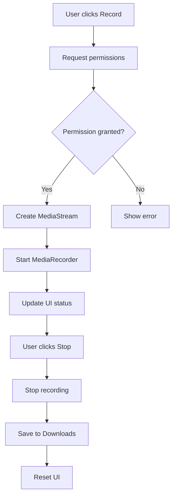

# 📹 Koom AI Chrome Extension

A powerful Chrome extension for screen and tab recording with an integrated camera overlay. Perfect for creating tutorials, presentations, and recording web content with professional-quality output.


## ✨ Features

- 🎬 **Screen Recording** - Capture entire screen or specific applications
- 🌐 **Tab Recording** - Record specific browser tabs with audio
- 📸 **Camera Overlay** - Add floating camera preview to recordings
- 🎵 **Audio Capture** - Record system audio and microphone
- 💾 **Auto Save** - Automatically save recordings to downloads
- ⚡ **Background Processing** - Uses offscreen documents for optimal performance
- 🎨 **Clean UI** - Intuitive popup interface with recording status

## 🚀 Quick Start

### Installation

1. **Clone the repository**

   ```bash
   git clone https://github.com/yourusername/koom-ai-chrome-extension.git
   cd koom-ai-chrome-extension
   ```

2. **Load in Chrome**

   - Open Chrome and go to `chrome://extensions/`
   - Enable **Developer mode** (toggle in top right)
   - Click **Load unpacked**
   - Select the `koom-ai-chrome-extension` folder

3. **Pin the Extension**
   - Click the extensions icon (puzzle piece) in Chrome toolbar
   - Pin the Koom AI Recorder extension for easy access

### Usage

1. **Click the extension icon** to open the recorder
2. **Choose recording type:**
   - 🖥️ **Record Screen** - Capture entire desktop or application window
   - 🌐 **Record Tab** - Record current browser tab
3. **Start recording** and the status will update
4. **Stop recording** when finished - file saves automatically to Downloads

## 📁 Project Structure

```
koom-ai-chrome-extension/
├── 📋 manifest.json          # Extension configuration & permissions
├── 🎨 popup.html             # Main UI interface
├── ⚡ popup.js               # UI logic & user interactions
├── 🔧 service_worker.js      # Background recording management
├── 💉 content.js             # Camera overlay injection
├── 🎬 offscreen.js           # Screen capture handler
├── 📸 camera.html/js         # Floating camera component
├── 🎥 video.html/js          # Video processing utilities
└── 🎭 icons/                 # Extension icons
    ├── not-recording.png     # Default state icon
    └── recording.png         # Active recording icon
```

## 🔧 Technical Details

### Architecture

- **Manifest V3** - Latest Chrome extension standard
- **Service Worker** - Background script for recording management
- **Offscreen Documents** - Handle media recording without UI interference
- **Content Scripts** - Inject camera overlay into web pages
- **Storage API** - Persist recording state across sessions

### Permissions Required

```json
{
  "permissions": [
    "tabCapture", // Record browser tabs
    "desktopCapture", // Record screen content
    "offscreen", // Background document creation
    "scripting", // Inject content scripts
    "storage", // Save recording state
    "tabs" // Access tab information
  ]
}
```

### Browser Support

- ✅ Chrome 116+
- ✅ Chromium-based browsers (Edge, Brave, etc.)
- ❌ Firefox (uses different extension API)
- ❌ Safari (different extension system)

## 🛠️ Development

### Prerequisites

- Chrome Browser (version 116+)
- Basic knowledge of JavaScript, HTML, CSS
- Chrome Extensions Developer Mode enabled

### Local Development

1. **Make changes** to any file in the project
2. **Reload extension** in `chrome://extensions/` (click reload button)
3. **Test functionality** by clicking the extension icon
4. **Debug using DevTools:**
   - **Popup**: Right-click extension icon → "Inspect popup"
   - **Service Worker**: Click "service worker" link in extensions page
   - **Content Script**: Use regular DevTools on any webpage

### File Responsibilities

| File              | Purpose              | Key Functions                                    |
| ----------------- | -------------------- | ------------------------------------------------ |
| popup.js          | UI interactions      | `startRecording()`, `checkRecording()`, `init()` |
| service_worker.js | Background processes | Recording management, file handling              |
| content.js        | Page injection       | Camera overlay creation                          |
| offscreen.js      | Screen capture       | MediaRecorder API handling                       |

## 📸 Screenshots

### Extension Popup Interface


### Camera Overlay Example


### Recording Status


## 🔍 API Reference

### Chrome Extension APIs Used

- **`chrome.tabCapture`** - Capture tab audio/video
- **`chrome.desktopCapture`** - Request screen recording permission
- **`chrome.offscreen`** - Create background documents
- **`chrome.scripting`** - Inject scripts into pages
- **`chrome.storage.local`** - Store recording state
- **`chrome.runtime`** - Message passing between scripts

### Recording Workflow



## 🚨 Troubleshooting

### Common Issues

1. **"Hello World!!!" not printing**

   - Check browser console for errors
   - Verify DOM elements exist in popup.html
   - Ensure popup.js is loaded correctly

2. **Recording not starting**

   - Check microphone/screen recording permissions
   - Verify service worker is active
   - Look for permission errors in console

3. **Camera overlay not appearing**
   - Check if content.js is injecting properly
   - Verify camera.html file exists and is accessible
   - Check for CSP (Content Security Policy) blocks

### Debug Steps

```bash
# Check extension status
chrome://extensions/

# View service worker console
Click "service worker" link in extension details

# Debug popup
Right-click extension icon → "Inspect popup"

# Check storage
Chrome DevTools → Application → Storage → Extensions
```

## 🤝 Contributing

1. **Fork the repository**
2. **Create feature branch**: `git checkout -b feature/amazing-feature`
3. **Commit changes**: `git commit -m 'Add amazing feature'`
4. **Push to branch**: `git push origin feature/amazing-feature`
5. **Open Pull Request**

### Development Guidelines

- Follow Chrome Extension best practices
- Use Manifest V3 APIs only
- Add error handling for all async operations
- Include console logging for debugging
- Test across different Chrome versions

## 📄 License

This project is licensed under the MIT License - see the LICENSE file for details.

## 🙋 Support

- **Issues**: [GitHub Issues](https://github.com/yourusername/koom-ai-chrome-extension/issues)
- **Discussions**: [GitHub Discussions](https://github.com/yourusername/koom-ai-chrome-extension/discussions)
- **Email**: your.email@example.com

## 🌟 Acknowledgments

- Chrome Extensions documentation
- MediaRecorder API specifications
- Screen Capture API reference
- Community feedback and contributions

---

**Made with ❤️ for content creators and developers**

**⭐ Star this repo if it helped you!**
